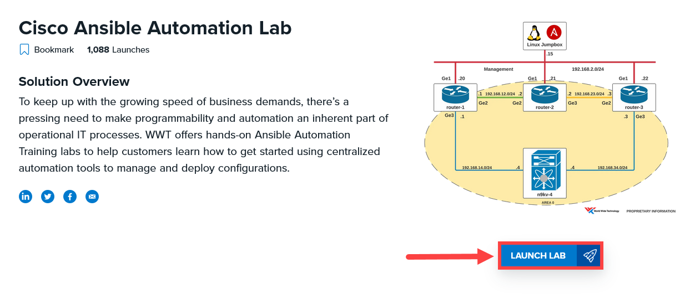

# Netbox Data Demo

A repository to demonstrate how NetBox can be setup and configured as a source of truth inside WWT's [Cisco Ansible Automation Lab](https://www.wwt.com/lab/cisco-ansible-automation-training-lab).

## Installation Steps

1. Register and launch a copy of the Cisco Ansible Lab at https://www.wwt.com/lab/cisco-ansible-automation-training-lab



2. Once in the lab, open up a terminal window and clone this repository.

```bash
git clone https://github.com/tylerhatton/netbox-data-demo.git
```

3. Go to the netbox-data-demo directory and start up Netbox using docker-compose.

```bash
cd netbox-data-demo
docker-compose up -d
```

4. After several minutes, open a browser and verify NetBox is running at http://127.0.0.1:8080/

5. Install the Python dependencies used by Ansible.

```bash
pip3 install -r playbooks/requirements.txt
```

6. Install the NetBox Ansible Collection dependencies used by Ansible.

```bash
ansible-galaxy collection install netbox.netbox
```

7. Execute Ansible playbook to perform initial configuration of Cisco CSRs in lab to add interface and routing configurations.

```bash
ansible-playbook playbooks/00_setupdevices.yml -i playbooks/hosts
```

8. Execute Ansible playbook to initially set up NetBox with site, rack, platform, and device information.

```bash
ansible-playbook playbooks/01_configurenetbox.yml -i playbooks/hosts
```